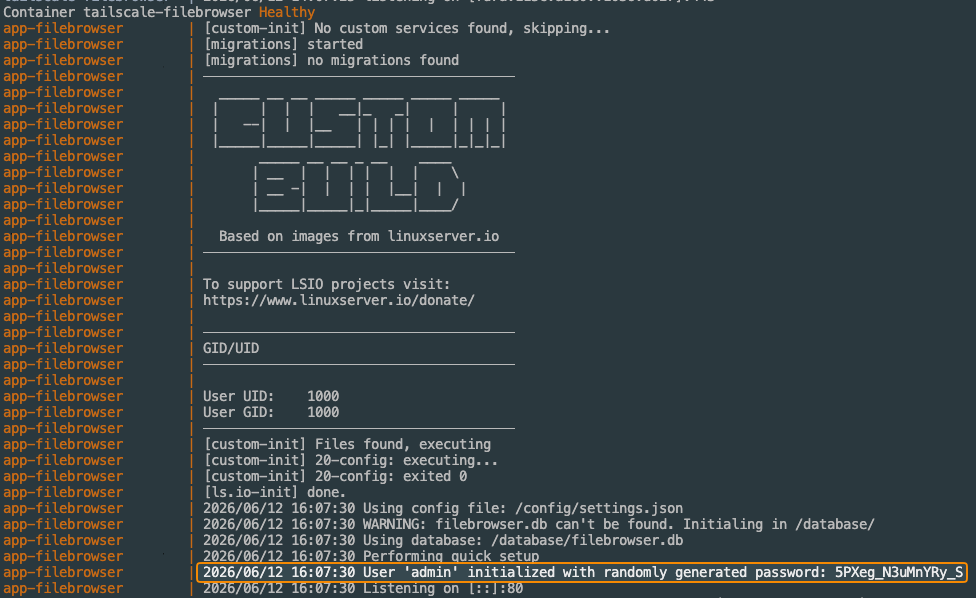

# Filebrowser with Tailscale Sidecar Configuration

This Docker Compose configuration sets up **Filebrowser** with a Tailscale sidecar container, enabling secure, private access to your self-hosted web file manager over your Tailnet. With this setup, your Filebrowser instance is **not exposed to the public internet** and is only accessible from authorized devices connected via Tailscale.

## Filebrowser

[**Filebrowser**](https://github.com/filebrowser/filebrowser) is a lightweight, self-hosted web file manager that provides a clean browser-based interface for managing files inside a specified directory. It can be used to upload, download, delete, preview, rename, and edit files directly from a web interface.

Filebrowser is often used as a simple "create-your-own-cloud" style service. You point it at a directory on your server, then manage that directory through the browser instead of needing direct SSH, SMB, SFTP, or local filesystem access. It also supports multiple users, making it useful for small teams, home labs, shared storage locations, and private file management workflows.

## Key Features

- 📂 Web-based file management for a configured server directory
- ⬆️ Upload, download, rename, move, copy, delete, preview, and edit files
- 👥 Multi-user support with user-specific scopes and permissions
- 🔗 File and folder sharing options for controlled access
- 🧭 Simple browser interface for managing server-side files
- 🧰 Lightweight deployment with minimal service overhead
- 🔐 Tailnet-only access when paired with the included Tailscale sidecar

## Usage Notes

Make sure to get your initial admin password from the Docker logs.

Once logged in, review the configured user accounts, permissions, sharing settings, and file root path before using the service with important data. Since Filebrowser can directly modify files on the mounted host directory, permissions should be treated carefully.

## Files to Check

- `compose.yaml` - Main Docker Compose configuration for Filebrowser and the Tailscale sidecar
- `.env` - Environment variables such as `TS_AUTHKEY`, Tailscale hostname, and any deployment-specific values
- Mounted file directory - Host path exposed to Filebrowser for web-based file management
- Filebrowser database/config path - Persistent storage for users, settings, permissions, and configuration

## References

- [Filebrowser Website](https://filebrowser.org/)
- [Filebrowser GitHub Repository](https://github.com/filebrowser/filebrowser)
- [Filebrowser Docker Image](https://hub.docker.com/r/filebrowser/filebrowser)
- [Tailscale Docker Documentation](https://tailscale.com/kb/1282/docker)
