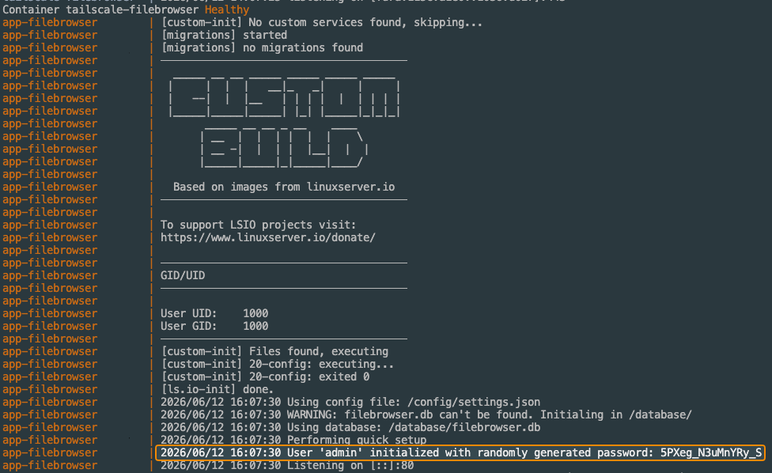

# File Browser

[File Browser](https://filebrowser.org/) is a file manager for the browser. You upload, download, preview, rename, edit, and share the files of one folder on your server.

Upstream has archived the project. It gets no further releases and no security fixes, and upstream lists known unaddressed security issues in its README. The command runner has been off by default since File Browser v2.33.8. Keep it off, and do not enable Tailscale Funnel for this stack.

This stack runs File Browser with a Tailscale sidecar, as described in [the standard setup](../../documentation/standard-setup.md).

## At a glance

| Item          | Value                                                      |
| ------------- | ---------------------------------------------------------- |
| Web interface | `https://filebrowser.<tailnet>.ts.net`                     |
| Service port  | `80`                                                       |
| Image         | `filebrowser/filebrowser:s6`                               |
| Data          | `./filebrowser-data` (your files, `/srv` in the container) |
|               | `./filebrowser-database` (users and settings)              |
|               | `./filebrowser-config` (configuration)                     |

## Before you start

To manage an existing folder, point the `/srv` volume in `compose.yaml` at it. File Browser can change and delete everything in that folder.

## Deviations from the standard setup

- **Data folders.** The data is in `./filebrowser-data`, `./filebrowser-database`, and `./filebrowser-config`, next to each other in this directory.

## First run

1. File Browser creates the user `admin` with a random password at the first start. Find it in the log:

   ```bash
   docker logs app-filebrowser 2>&1 | grep "randomly generated password"
   ```

2. Open the web interface and log in.
3. Change the password, and review the users, permissions, and sharing settings before you use File Browser with important data.

The log line with the password looks like this:



## Links

- [File Browser documentation](https://github.com/filebrowser/filebrowser/tree/master/docs)
- [File Browser source code](https://github.com/filebrowser/filebrowser)
